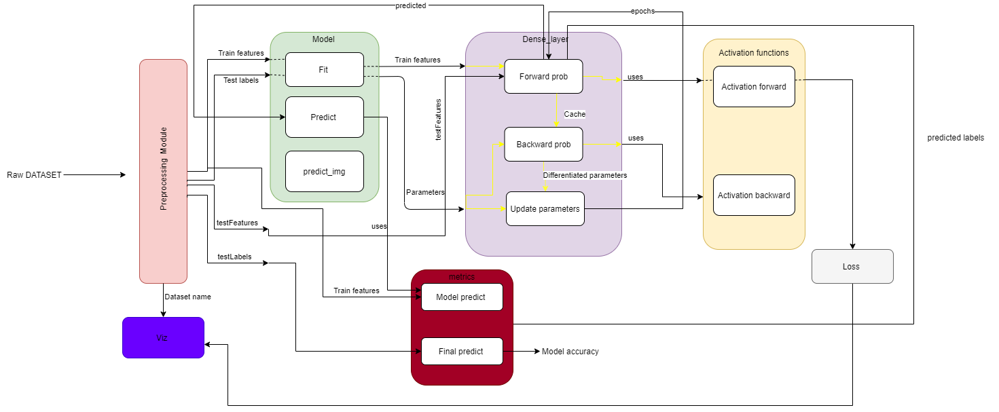

# Simple Neural Network FrameWork 

This repo will take you through all the steps to create and train a deep neural network without using any of the deep learning libraries like Tensorflow, caffe etc.

## __Installation__ 
Use the package manager [pip](https://pip.pypa.io/en/stable/) to install all the Prerequisites and build the neural network 

## __Prerequisites__ 
```bash
1. pip install numpy  
2. pip install matplotlib 
3. pip install pickle-mixin
4. pip install pandas
5. sudo apt-get install python-PIL
```

## __Architecture__ 



#### Traing the model follows the following pattern, illustrated in the image above 
* Load the data
* Intialize the parameters and feed forward 
* compute the cost 
* backward propagation and update parameters
* predict and visualize accuracies